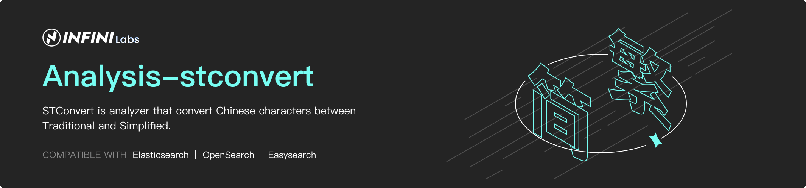

STConvert Analysis for Elasticsearch and OpenSearch
==================================




STConvert is analyzer that convert Chinese characters between Traditional and Simplified. It supports major versions of Elasticsearch and OpenSearch. Maintained and supported with ❤️ by [INFINI Labs](https://infinilabs.com).


The plugin includes  analyzer: `stconvert`,
 tokenizer: `stconvert`,
 token-filter:  `stconvert`,
 and char-filter: `stconvert`

# Optional Parameters

Supported config:

- `convert_type`: default `s2t` ,optional option:
    1. `s2t` ,convert characters from Simple Chinese to Traditional Chinese
    2. `t2s` ,convert characters from Traditional Chinese to Simple Chinese

- `keep_both`:default `false` ,

- `delimiter`:default `,`


# How to Install

You can download the packaged plugins from here: `https://release.infinilabs.com/`, 

or you can use the `plugin` cli to install the plugin like this:

For Elasticsearch

```
bin/elasticsearch-plugin install https://get.infini.cloud/elasticsearch/analysis-stconvert/8.4.1
```

For OpenSearch

```
bin/opensearch-plugin install https://get.infini.cloud/opensearch/analysis-stconvert/2.12.0
```

Tips: replace your own version number related to your elasticsearch or opensearch.


# Getting Started

Mapping example:

```
PUT /stconvert/
{
    "settings" : {
        "analysis" : {
            "analyzer" : {
                "tsconvert" : {
                    "tokenizer" : "tsconvert"
                    }
            },
            "tokenizer" : {
                "tsconvert" : {
                    "type" : "stconvert",
                    "delimiter" : "#",
                    "keep_both" : false,
                    "convert_type" : "t2s"
                }
            },   
             "filter": {
               "tsconvert" : {
                     "type" : "stconvert",
                     "delimiter" : "#",
                     "keep_both" : false,
                     "convert_type" : "t2s"
                 }
             },
            "char_filter" : {
                "tsconvert" : {
                    "type" : "stconvert",
                    "convert_type" : "t2s"
                }
            }
        }
    }
}
```


Analyze tests

```
GET stconvert/_analyze
{
  "tokenizer" : "keyword",
  "filter" : ["lowercase"],
  "char_filter" : ["tsconvert"],
  "text" : "国际國際"
}

Output：
{
  "tokens": [
    {
      "token": "国际国际",
      "start_offset": 0,
      "end_offset": 4,
      "type": "word",
      "position": 0
    }
  ]
}
```

Normalizer usage

```
DELETE index
PUT index
{
  "settings": {
    "analysis": {
      "char_filter": {
        "tsconvert": {
          "type": "stconvert",
          "convert_type": "t2s"
        }
      },
      "normalizer": {
        "my_normalizer": {
          "type": "custom",
          "char_filter": [
            "tsconvert"
          ],
          "filter": [
            "lowercase"
          ]
        }
      }
    }
  },
  "mappings": {
    "properties": {
      "foo": {
        "type": "keyword",
        "normalizer": "my_normalizer"
      }
    }
  }
}

PUT index/_doc/1
{
  "foo": "國際"
}

PUT index/_doc/2
{
  "foo": "国际"
}

GET index/_search
{
  "query": {
    "term": {
      "foo": "国际"
    }
  }
}

GET index/_search
{
  "query": {
    "term": {
      "foo": "國際"
    }
  }
}
```


# Community

Fell free to join the Discord server to discuss anything around this project: 

[https://discord.gg/4tKTMkkvVX](https://discord.gg/4tKTMkkvVX)

# License

Copyright ©️ INFINI Labs.

Licensed under the Apache License, Version 2.0 (the "License");
you may not use this file except in compliance with the License.
You may obtain a copy of the License at

    http://www.apache.org/licenses/LICENSE-2.0

Unless required by applicable law or agreed to in writing, software
distributed under the License is distributed on an "AS IS" BASIS,
WITHOUT WARRANTIES OR CONDITIONS OF ANY KIND, either express or implied.
See the License for the specific language governing permissions and
limitations under the License.
